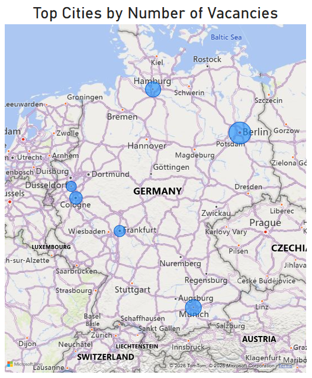
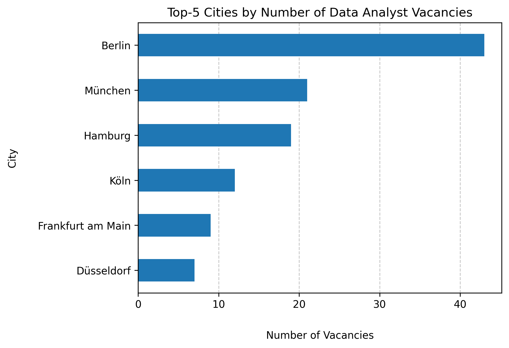
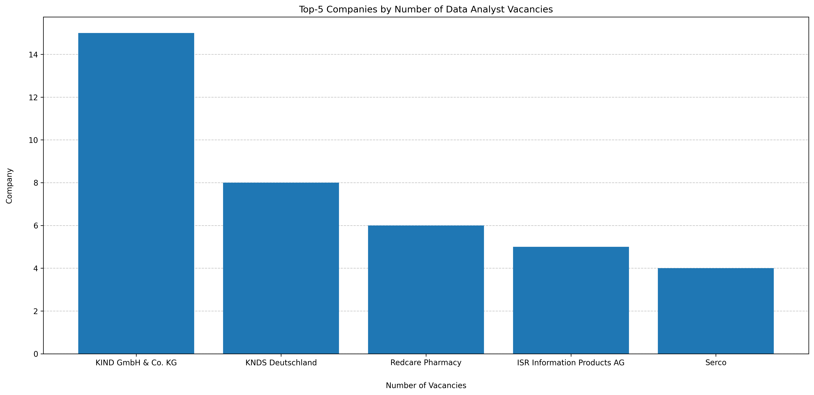
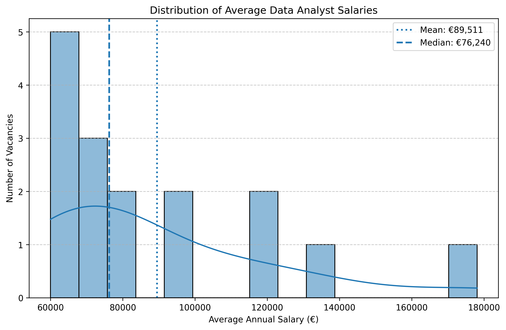

# Data Analyst Jobs in Germany

## Project Overview

This project analyzes Data Analyst job postings in Germany using data collected from the Adzuna API.

The goal is to understand:
- how many Data Analyst vacancies are available,
- where they are located,
- which companies hire the most analysts,
- what salary information is available.

## Key Findings

1. Senior-level vacancies account for about a quarter of all Data Analyst positions, while junior positions are relatively rare, making up only 11% of vacancies.
2. Most vacancies are concentrated in major cities: Berlin, Hamburg, Cologne, Munich, etc.
3. A German healthcare technology company **KIND GmbH & Co KG** hires the most data analyst.
4. Salary transparency is limited. Only 8% of job postings have salary informaion.
5. Most reported average salaries are concentrated between €55,000 and €80,000 per year.

## Visualisation 

### A Map of Top Cities by Number of Vacancies



### Top Cities by Number of Vacancies



### Top Companies by Number of Vacancies



### Salary Distribution


The average annual salary distribution is right-skewed. A small number of exceptionally high salaries pull the mean upward (to the right). Therefore, the median is a more representative measure of the typical average salary.

## Power BI Dashboard

Interactive Power BI dashboard is available in:

`dashboard/dashboard.pbix `

## Data Source

Source: Adzuna API

Data collection date: June 3, 2026

Records: 4,323 job postings

Key fields:
- title
- company
- location
- description
- salary_min
- salary_max

## Data Preparation

### Filtering

For data collection from the Adzuna API, the keyword **"data"** was used in job titles.

To focus the analysis on Data Analyst positions, the collected dataset was filtered using the following keywords:

- data analyst
- daten analyst
- datenanalyst

The following postings were excluded:

- Weiterbildung
- Bildungsgutschein

### Cleaning

The dataset required preprocessing of the `location` and `company` fields.

These fields were retrieved from the API as JSON objects and stored as strings in the dataset. To extract city and company names, the strings were converted back to dictionaries using Python's `ast` library.

The resulting `city` field contained a mixture of locations. The following cleaning steps were performed:

- removed the value `Deutschland`
- removed federal states
- consolidated major city districts into their corresponding cities (e.g., Mitte → Berlin, Altstadt-Lehel → Munich)

## Project Structure

```text
german-data-jobs-analysis/
├── dashboard/
│   ├── dashboard.pbix
│   ├── key_metrics.csv
│   ├── top_cities.csv
│   └── top_companies.csv
├── data/
│   └── jobs_snapshot.csv
├── notebooks/
│   └── job_analysis.ipynb
├── src/
│   └── collect_data.py
├── visuals/
│   ├── salary_distribution.png
│   ├── top_cities_by_salary.png
│   ├── top_cities_by_vacancies.png
│   ├── top_companies_by_salary.png
│   └── top_companies_by_vacancies.png
├── .gitignore
├── README.md
└── requirements.txt
```

## Tools

- Python
- pandas
- Adzuna API
- Power BI
- GitHub

## Setup

### API Credentials

Get APP_ID and APP_KEY by registering for a free developer account on the Adzuna website.

To run this project, create a `.env` file in the project root directory and add your Adzuna API credentials:

```env
APP_ID = 'your_app_id'
APP_KEY = 'your_app_key'
```

### Install Dependencies

`pip install -r requirements.txt`

### Run Data Collection

`python -m src.collect_data`

### Run Analysis

Open and run:

`notebooks/job_analysis.ipynb`

## Project Limitations

1. API limitation. The field `'description'` was truncated up to 500 characters, so I could not extract information about skills, technologies, or language requirements.
2. Small number of junior vacancies.
3. The lack of salary information. Since salary information is available for only a small fraction of vacancies, these results do not represent the entire market.


